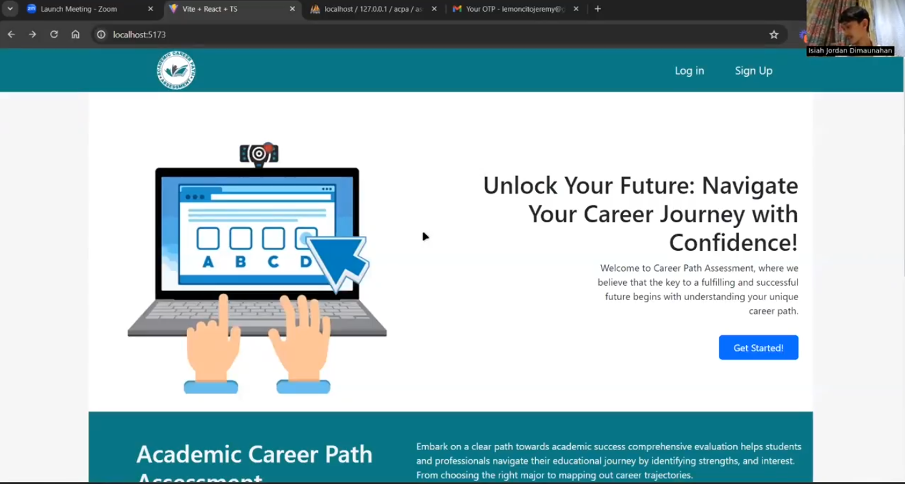
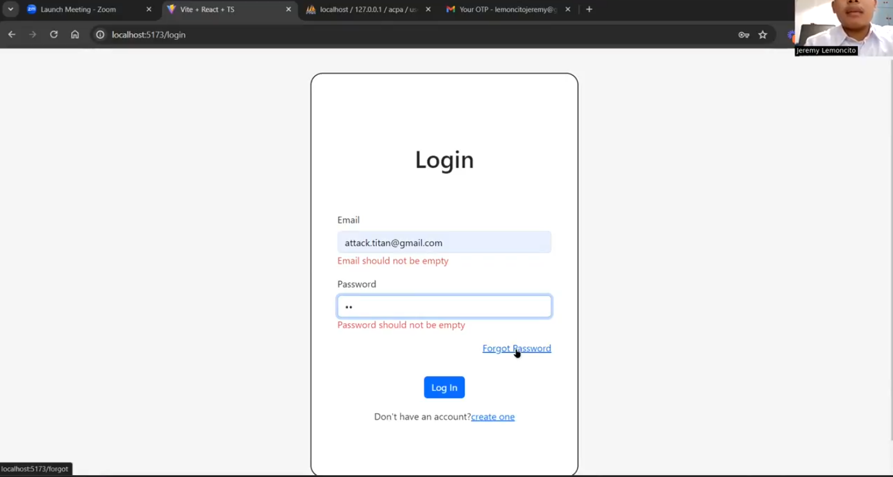
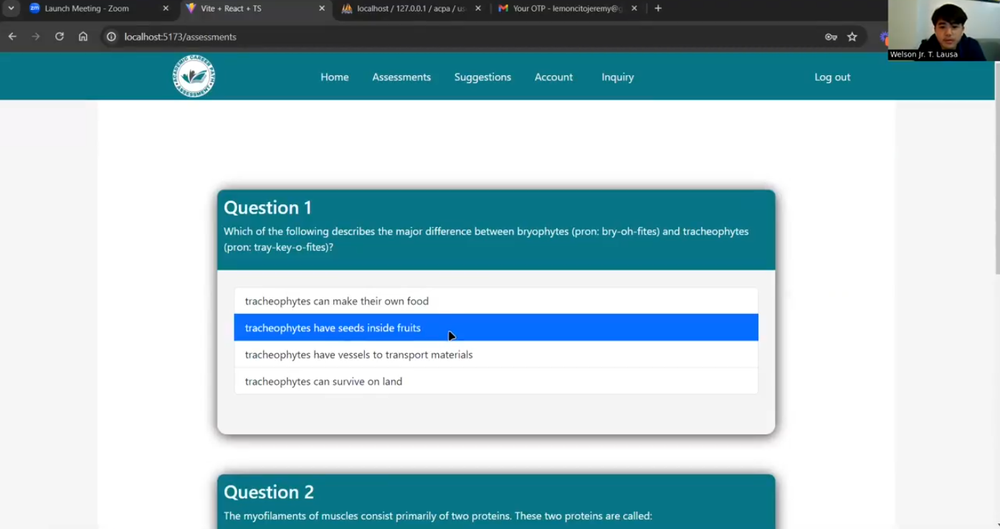
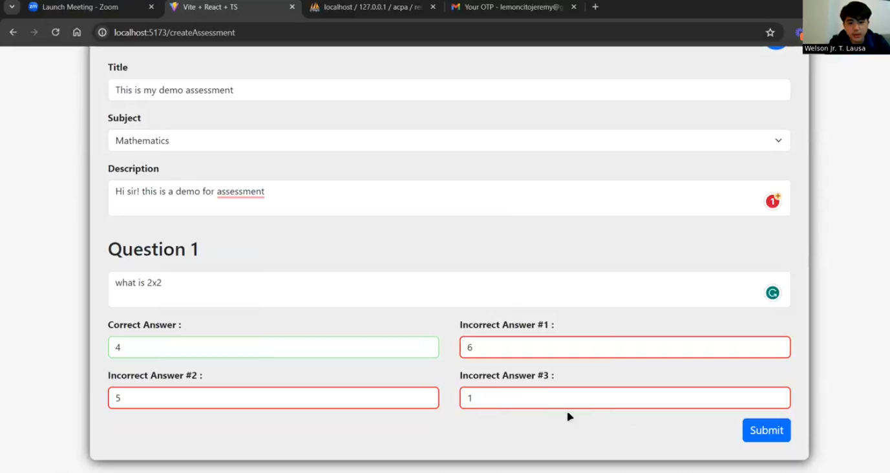

# Academic Career Path Assessment

Develop in React, Nodejs, and Express. The goal of the project is to digitalize the NCAE test for
inspiring highschool students assisting on their decision for their future careers. 

---

## 🚀 Features

* Feature 1 — Login/Sign-Up with OTP code Authentication
* Feature 2 — Profile Modification Features
* Feature 3 — User and Admin roles
* Feature 4 - Assessment Career
* Feature 5 - Error Validation
* Featuer 6 - RESTful API
* Feature 7 - Performance Metrics
* Feature 8 - Recommendation
* Feature 9 - KPI Dashboard
* Feature 10 - Create Assessment
* Feature 11 - Logs & Archives

---

## 🛠 Tech Stack

**Frontend:** React, Plotly, Vite Typescript
**Backend:** Node.js, Express, Cors
**Other:** CSS, Axios, Docker, MYSQL

---

## 📸 Screenshot

*Live Presentation of ACPA as part of the Software Engineering Requirements*

---

## 👥 Contributors

| Name                        | Role                           | GitHub Profile                                   |
| --------------------------- | ------------------------------ | ------------------------------------------------ |
| Isiah Jordan Dimaunahan     | Full Stack Developer           | (https://github.com/IsiahJordan)                 |
| Jeremy Lemoncito            | Full Stack Developer           | (https://github.com/lemoncitoJeremy)             |
| Ormin Cariaso               | Documentation & Database Admin | (https://github.com/ocariaso)                    |
| Welson Lausa                | UI\UX Designer                 |                                                  |

---

## 📄 License

This project is licensed under the **Apache License** — see the [LICENSE](./LICENSE) file for details.

